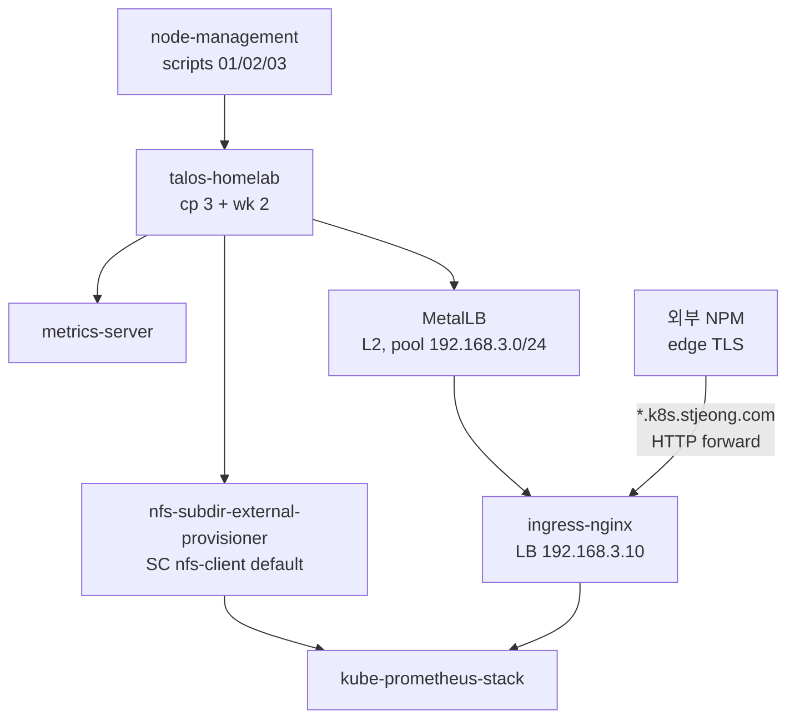

# 아키텍처

`talos-homelab` 클러스터의 노드 토폴로지와 도입 컴포넌트 6개의 의존 그래프. 운영자가 머리에 들고 있어야 하는 그림.

## 노드 토폴로지

| 역할 | 노드 | IP | VMID | 리소스 (기본) |
|---|---|---|---|---|
| Control plane | `talos-cp-01` | 192.168.2.106 | 106 | 2 vCPU / 4 GiB / 32 GB |
| Control plane | `talos-cp-02` | 192.168.2.107 | 107 | 2 vCPU / 4 GiB / 32 GB |
| Control plane | `talos-cp-03` | 192.168.2.108 | 108 | 2 vCPU / 4 GiB / 32 GB |
| Worker | `talos-wk-01` | 192.168.2.111 | 111 | 4 vCPU / 4 GiB / 64 GB |
| Worker | `talos-wk-02` | 192.168.2.112 | 112 | 4 vCPU / 4 GiB / 64 GB |
| **CP VIP** | (Talos native) | **192.168.2.100** | — | etcd leader election으로 cp 한 대가 보유 |

전체 5대 모두 단일 Proxmox 호스트 `pve`(192.168.1.3)에서 동작. cp 3대로 etcd 쿼럼 유지(2대까지 손실 가능 X — 1대까지 손실 가능). 노드 리소스의 권위 있는 정의는 `node-management/03-create-talos-vm.sh`.

요점: `kubectl`/`talosctl`은 cluster endpoint **`192.168.2.100`** 으로만 보낸다 — VIP 보유자가 바뀌어도 명령 경로가 유지된다.

## 컴포넌트 의존 그래프

- `metrics-server`는 의존 없음 — 가장 가벼운 시작점.
- `nfs-subdir-external-provisioner` / `MetalLB`도 서로 독립.
- `ingress-nginx`는 MetalLB의 LB IP에 의존.
- `kube-prometheus-stack`은 NFS SC + Ingress의 두 전제를 모두 요구.
- 외부 NPM은 클러스터 바깥의 사전 구성 — 본 프로젝트가 관리하지 않는다.

각 컴포넌트의 역할/한계는 [컴포넌트](../components/index.md)에서 한 페이지씩.

## 데이터 / 트래픽 흐름

### 1. 외부 → 서비스

1. 사용자가 `https://<svc>.k8s.stjeong.com`을 친다.
2. NPM이 `*.k8s.stjeong.com` 와일드카드 매칭 → TLS 종단 → `192.168.3.10:80`(ingress-nginx LB)으로 HTTP forward.
3. ingress-nginx가 host/path 기반 라우팅으로 클러스터 Service에 전달.
4. Service → Pod → 응답.

자세한 책임 분리는 [외부 노출 모델](external-exposure.md).

### 2. 운영자 → 클러스터

1. `kubectl` → cluster endpoint `192.168.2.100:6443` (cp VIP 보유자가 받음) → kube-apiserver.
2. `talosctl` → 노드 IP 직접 (`--nodes 192.168.2.106` 등) → talos apid.
3. `ssh pve` → Proxmox 호스트 → `qm`/`pvesm`/`talosctl`로 VM·snippets 조작.

### 3. PVC → NFS

1. 워크로드가 PVC 생성 (SC 미지정 또는 `storageClassName: nfs-client`).
2. nfs-subdir-external-provisioner가 NAS `nknas`(192.168.1.4)의 `/volume1/nfsvolume/<namespace>-<pvc>-<pv>/` 디렉토리 생성.
3. PV가 생성되어 PVC와 Bound. 워크로드가 마운트.
4. PVC 삭제 시 `reclaimPolicy=Delete` + `archiveOnDelete=false`이므로 NFS 디렉토리도 함께 사라짐.

## 장애 / 동시성 모델

- **cp 1대 손실**: VIP가 다른 cp로 즉시 fail-over. etcd 쿼럼은 2/3로 유지. kubectl/talosctl은 끊기지 않거나 수 초 안에 복구.
- **cp 2대 손실**: etcd 쿼럼 깨짐. 클러스터가 read-only로 떨어지고 새 워크로드 배포 불가. 복구 절차는 [런북 §1](../operating/runbook.md#1-etcd-쿼럼-손실-진단).
- **worker 1대 손실**: ingress-nginx replicaCount=2 + anti-affinity로 wk-01/wk-02에 분산되어 있어 한 대 죽어도 LB 트래픽이 다른 worker로 흐른다. 단, `externalTrafficPolicy=Local`이라 announce된 노드에 controller pod이 없으면 트래픽이 끊기므로 두 대 모두 죽으면 외부 진입이 끊김.
- **NFS NAS 장애**: 모든 PVC 워크로드가 IO 블록. metrics-server / MetalLB / ingress-nginx는 PV를 안 쓰므로 영향 없음. 복구는 NAS 측 — 클러스터 측 대응은 [트러블슈팅 — NFS 마운트 장애](../operating/troubleshooting.md#nfs-pvc가-mount-실패--읽기쓰기-iohang).

## 의도적으로 하지 않은 것

- **분산 블록 스토리지(Longhorn/Rook-Ceph) 미도입** — NAS 단일 NFS export로 충분. 워커에 별도 디스크가 추가되거나 RWX 외 다른 access mode가 필요해지면 도입 검토.
- **클러스터 측 TLS / cert-manager 미도입** — 외부 NPM이 edge TLS 종단. mTLS / 내부 서비스 간 TLS가 필요해지면 그때.
- **GitOps(ArgoCD/Flux) 미도입** — 운영자 1명, 컴포넌트 6개에서 수동 helm/kubectl로 충분. 컴포넌트 5~6개를 넘으면 도입 검토.
- **HPA / VPA / KEDA 미도입** — 트래픽이 본 단계에서는 사람 1명 + 모니터링 한 대 수준이라 자동 스케일이 비용 대비 이득 적음. metrics-server는 도입했으므로 필요하면 즉시 HPA를 붙일 수 있음.
- **Ingress IP DNS A 레코드 직접 발급 미도입** — 외부 도메인 라우팅은 NPM이 담당. 클러스터가 외부 DNS를 직접 조작하지 않는다(external-dns 등 미설치).
- **kube-vip / keepalived 미도입** — Talos native VIP가 같은 일을 하므로 중복 배제.
