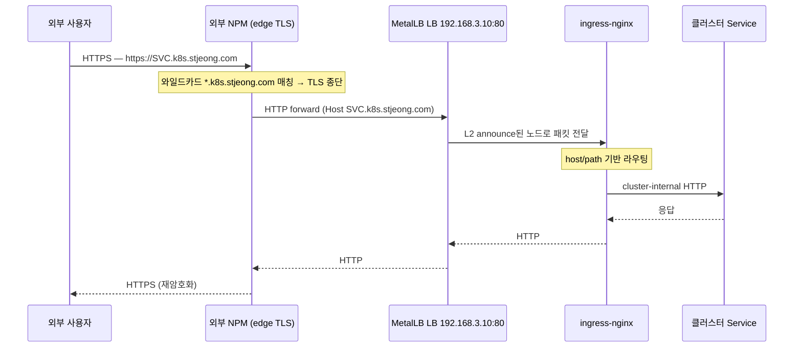

# 외부 노출 모델

클러스터 외부 사용자가 `https://<svc>.k8s.stjeong.com`을 칠 때 트래픽이 어디서 TLS를 종단하고, 어디서 host 라우팅을 하고, 누가 무엇을 책임지는지의 합의.

## 한 문장 요약

**TLS는 외부 NPM에서 종단, 클러스터 안은 평문 HTTP만 흐른다.**

따라서 클러스터 측에는 cert-manager / DNS / TLS 어노테이션이 필요 없다. 새 호스트(`<svc>.k8s.stjeong.com`)는 `Ingress` 리소스만 만들면 NPM이 와일드카드로 자동 받아 forward — NPM 측 추가 설정 불필요.

## 트래픽 흐름



## 책임 분리

| 책임 | 누가 | 어디서 |
|---|---|---|
| 외부 도메인 와일드카드 (`*.k8s.stjeong.com`) | 외부 NPM | NPM 설정 (클러스터 바깥) |
| TLS 인증서 발급 / 갱신 | 외부 NPM | NPM이 Let's Encrypt 등으로 처리 |
| TLS 종단 (decrypt) | 외부 NPM | edge |
| HTTP forward 대상 | 외부 NPM | `192.168.3.10:80` 고정 |
| LB IP 할당 | MetalLB | `home-pool` (`192.168.3.0/24`)에서 핀 IP 분배 |
| host/path 라우팅 | ingress-nginx | 각 Service의 Ingress 리소스 |
| 클러스터 내 통신 | Service / kube-proxy | ClusterIP |

## 클러스터 측 Ingress 작성 합의

새 서비스를 외부에 노출할 때:

1. `Service`(ClusterIP) 만든다.
2. `Ingress`를 만들고 `host: <svc>.k8s.stjeong.com` 박는다. **`tls:` 섹션은 만들지 않는다.**
3. IngressClass는 생략 가능 — `nginx`가 클러스터 default.
4. 끝. NPM이 와일드카드로 받아 자동 forward.

reverse-proxy aware 앱(Grafana 등)은 `root_url` / `domain` / `X-Forwarded-Proto` 처리 등 외부 URL이 `https://`라는 사실을 앱에 알려야 redirect/링크가 깨지지 않는다. 본 클러스터의 Grafana는 `grafana.ini.server.root_url = https://grafana.k8s.stjeong.com`로 박혀 있음 — 자세한 건 [components/kube-prometheus-stack](../components/kube-prometheus-stack.md).

## 검증 한 줄

외부 → NPM → ingress-nginx → 서비스 경로 전체:

```bash
curl -sI https://grafana.k8s.stjeong.com/login
# HTTP/2 200 + 정상 cert chain → 전체 경로 정상
```

NPM 우회로 클러스터 측만 분리 검증:

```bash
curl -sI -H 'Host: grafana.k8s.stjeong.com' http://192.168.3.10/login
# HTTP/1.1 200 OK → ingress-nginx → Service 정상 (NPM 무관)
```

두 결과가 다르면 끊긴 구간을 좁힐 수 있다. 트러블슈팅은 [트러블슈팅 — Grafana 외부 접속이 안 되거나 redirect가 깨짐](../operating/troubleshooting.md#grafana-외부-접속이-안-되거나-redirect가-깨짐).

## 의도적으로 하지 않은 것

- **클러스터 측 TLS** — 모든 Ingress는 HTTP. cert-manager / ClusterIssuer / Certificate 리소스 미설치.
- **클러스터 측 DNS 조작** — external-dns 등으로 외부 DNS A 레코드를 자동 생성하지 않는다. NPM 와일드카드가 모든 host를 받아준다.
- **NPM의 클러스터 내 이중화** — NPM은 외부 호스트의 단일 인스턴스. NPM이 죽으면 외부 진입이 끊긴다 — 대응은 [런북 §8](../operating/runbook.md#8-외부-npm-다운).

## 알려진 한계

- **mTLS / 내부 서비스 간 TLS 미지원** — 클러스터 안은 평문이라 노드 간 트래픽을 가로챌 수 있는 위협 모델은 가정하지 않는다. 단일 호스트 / 같은 L2 / 신뢰된 환경 전제.
- **HTTP-only Ingress** — gRPC, WebSocket, TCP/UDP 노출이 필요하면 별도 LoadBalancer Service(MetalLB IP 직접 할당) + NPM stream 모듈을 같이 손봐야 한다.
- **NPM이 SPOF** — NPM 자체의 고가용성은 본 프로젝트가 책임지지 않는다. NPM이 죽으면 외부 진입이 끊기지만 클러스터 안 동작은 무관.
