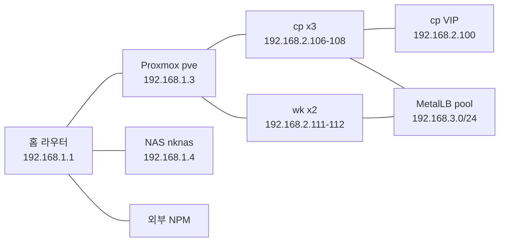

# 네트워크 토폴로지

`talos-homelab`은 단일 `192.168.0.0/16` 서브넷 위에 4개의 IP 대역을 분리해 운영한다. 어느 IP가 어디서 나오고 어느 라우팅 경로를 타는지가 정해져 있어야 MetalLB / VIP / DHCP 풀이 충돌하지 않는다.

## 대역 분리

| 대역 | 용도 | 출처 / 주체 | 비고 |
|---|---|---|---|
| `192.168.1.0/24` | 라우터 DHCP 풀 | 홈 라우터 | NAS `nknas`(192.168.1.4), Proxmox `pve`(192.168.1.3) 등 정적 매핑 |
| `192.168.2.0/24` | Talos 노드 IP (cp + wk) | 03 스크립트가 노드별 user.yaml에 박음 | cp 3 (`.106` `.107` `.108`) + wk 2 (`.111` `.112`) |
| **`192.168.2.100`** | **cp VIP (cluster endpoint)** | Talos `vip.ip` | etcd leader election으로 cp 한 대가 보유 |
| `192.168.3.0/24` | MetalLB IP 풀 (`home-pool`) | MetalLB IPAddressPool | Service `type=LoadBalancer`에 할당. ingress-nginx pin = `192.168.3.10` |

마스크는 모두 **`/16`** 으로 통일한다 (`/24` 아님) — 라우터의 LAN 인터페이스도 `/16`이라 노드 IP가 게이트웨이(`192.168.1.1`)와 같은 L2 broadcast domain에 있어야 ARP가 흐른다. cp/wk 머신 컨피그의 `addresses: [192.168.2.x/16]`이 이 합의를 박아둔 자리.

요점: 라우터 DHCP 풀이 `192.168.3.x`를 분배하면 MetalLB와 충돌. 라우터 측에서 DHCP 풀을 `192.168.1.x` 안으로 한정해 두어야 한다.

## L2 경로



- 모든 노드는 같은 Proxmox bridge `vmbr0`에 물려 있다 — 같은 L2 broadcast domain.
- MetalLB speaker가 cp/wk 모두에 떠 있어 어느 노드든 LB IP를 announce할 수 있음.
- 외부 NPM은 라우터 너머 또 다른 호스트. 클러스터로 들어오는 경로는 `NPM → 192.168.3.10:80`(ingress-nginx LB).

## VIP fail-over

cp 3대가 머신 컨피그에 `machine.network.interfaces[].vip.ip = 192.168.2.100`을 박아두고, Talos가 etcd 기반 leader election으로 한 cp에만 VIP를 attach. 다른 cp는 대기.

VIP 보유 cp 식별:

```bash
ssh pve "for ip in 192.168.2.106 192.168.2.107 192.168.2.108; do
  echo \"-- \$ip --\"
  talosctl --talosconfig ~/talos-cluster/_out/talosconfig \
    --endpoints \$ip --nodes \$ip get addresses 2>/dev/null \
    | grep '192.168.2.100/' || echo '(not holder)'
done"
```

VIP 보유자가 죽으면 다른 cp가 즉시 보유 — `kubectl get nodes`는 보통 끊기지 않거나 수 초 안에 복구. 자세한 운영 메모는 [노드 관리 가이드 § Control Plane VIP 운영](https://github.com/nineking424/k8s-ops/blob/main/node-management/node-management-guide.md#control-plane-vip-운영).

## MetalLB L2 announce

MetalLB는 BGP가 아닌 **L2 모드**로 동작 — speaker가 ARP/NDP로 LB IP를 announce. 한 IP는 한 노드만 announce(speaker leader election).

| 항목 | 값 |
|---|---|
| 모드 | L2 |
| IPAddressPool | `home-pool` (`192.168.3.0/24`) |
| L2Advertisement | `home-l2` (`home-pool`만 advertise) |
| Speaker | DaemonSet, 모든 노드(cp 3 + wk 2) |
| FRR | disabled (BGP 안 씀) |

LB IP 핀:

- `ingress-nginx-controller` Service가 `metallb.universe.tf/loadBalancerIPs: 192.168.3.10` 어노테이션으로 핀 — DNS/`/etc/hosts` 안정.
- 다른 LoadBalancer Service는 풀에서 자동 할당. 핀이 필요하면 같은 어노테이션을 박는다.

## 알려진 한계

- **단일 L2 도메인 가정** — 노드가 다른 L2 세그먼트로 분산되면 MetalLB L2 모드는 동작하지 않는다. 그 시점에 BGP 모드로 전환하거나 토폴로지를 단일 L2로 유지한다.
- **/16 마스크 강제** — 라우터의 LAN 인터페이스가 `/16`인 한 모든 노드도 `/16`이어야 한다. `/24`로 박으면 다른 `/24` 대역(LB 풀, VIP)으로 가는 패킷이 게이트웨이를 거쳐 라우팅되려고 시도하면서 외부 통신이 깨진다 — 자세한 진단은 [노드 관리 가이드 § 외부 통신 안 됨](https://github.com/nineking424/k8s-ops/blob/main/node-management/node-management-guide.md#외부-통신-안-됨-이미지-pull-실패-등).
- **Pod 네트워크는 별도** — Flannel CNI가 pod 간 통신용 overlay를 별도 대역에서 운영한다. 본 페이지는 노드/외부 노출 대역만 다룬다.
