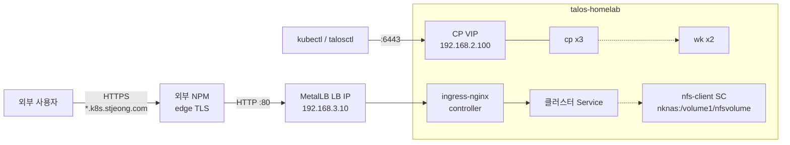

# k8s-ops

**Proxmox + Talos로 구성한 홈랩 Kubernetes 클러스터 `talos-homelab`의 운영·관리 작업 디렉토리.**
클러스터 매니페스트, 노드 프로비저닝 스크립트, 운영 가이드를 한곳에 모은다.

➡️ [일상 접근 패턴](getting-started/daily-access.md) · [런북](operating/runbook.md) · [트러블슈팅](operating/troubleshooting.md)

## 무엇을 해결하나

- **부트스트랩 절차의 권위 있는 사본** — Proxmox에 cloud-init으로 Talos 노드를 찍어내는 `01`/`02`/`03` 스크립트와 그 컨벤션을 한곳에 둔다. PVE 호스트 사본과 동기화 규약을 명시.
- **클러스터 컴포넌트 추가의 표준 폴더 골격** — `<component>/` 하나에 `install.sh`/`values.yaml`/`README.md`가 같은 컨벤션으로 들어가 운영자가 다른 컴포넌트로 옮길 때도 동일한 진입점을 쓴다.
- **장애 대응의 진단 한 줄** — 새벽 3시에 운영자가 `kubectl`/`talosctl`/`ssh pve` 한 줄을 어디서 보고 어떤 신호로 분기하는지 [트러블슈팅](operating/troubleshooting.md)과 번호로 참조 가능한 [런북](operating/runbook.md)에서 단일 경로로 정리.
- **외부 노출 / TLS 책임 분리** — 외부 nginx proxy manager(NPM)가 `*.k8s.stjeong.com` 와일드카드 + edge TLS를 담당하므로 클러스터 측은 HTTP Ingress만 정의한다. cert-manager / DNS / TLS 설정 불필요. 자세한 구조는 [외부 노출 모델](concepts/external-exposure.md).

## 누가 쓰나

| 역할 | 무엇을 하는가 | 시작 페이지 |
|---|---|---|
| **Operator** | kubectl/talosctl로 클러스터를 매일 다루고, 장애 대응을 한다 | [→ 일상 접근 패턴](getting-started/daily-access.md) |
| **Integrator** | 새 컴포넌트(차트/매니페스트)를 도입한다 | [→ 새 컴포넌트 도입](getting-started/adding-a-component.md) |
| **Contributor** | 스크립트를 고치고 폴더 컨벤션을 손본다 | [→ 컴포넌트 추가 컨벤션](developer/contributing.md) |

## 핵심 개념 한눈에

자세한 컴포넌트 다이어그램은 [아키텍처](concepts/architecture.md), 서브넷·VIP·LB 풀 분리는 [네트워크 토폴로지](concepts/network-topology.md), 외부 노출 흐름은 [외부 노출 모델](concepts/external-exposure.md) 참고.

## 다음 단계

- 클러스터에 처음 들어왔다면: [일상 접근 패턴](getting-started/daily-access.md) — kubectl 컨텍스트, `ssh pve`, `talosctl` 사용 위치를 정리.
- 장애 대응이 급하면: [트러블슈팅](operating/troubleshooting.md) — 증상 → 진단 한 줄 → 조치 → 확인.
- 절차가 필요하면: [런북](operating/runbook.md) — 번호로 매겨진 §1–§10 시나리오.
- 새 컴포넌트를 올리려면: [새 컴포넌트 도입](getting-started/adding-a-component.md), 그리고 [컴포넌트 추가 컨벤션](developer/contributing.md).
- 자주 묻는 질문: [FAQ](faq.md).
